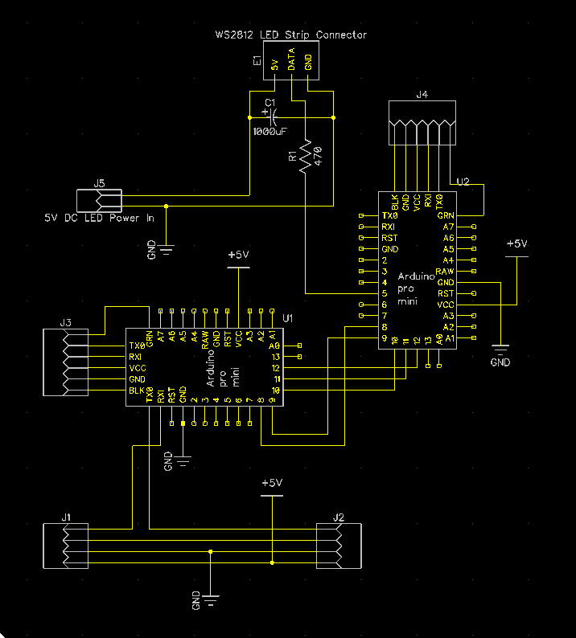

# LED Module for [Chorus RF Laptimer](https://github.com/voroshkov/Chorus-RF-Laptimer)

This module is an add-in hardware for the Chorus Laptimer device so it won't work on its own.

The module allows you to light up the moment when a racing drone passes the finish gate. Each VTX channel has its own color, so spectators can easily see which pilot makes the lap.

**NOTE: This is rather an exemplary implementation than a finished project. Feel free to rework it to power your own Chorus add-ins.**

## Contents

<!-- MarkdownTOC depth=0 bracket="round" autolink="true" autoanchor="true" -->

- [Features](#features)
- [Limitations](#limitations)
- [How it works](#how-it-works)
- [Hardware](#hardware)
    - [Components](#components)
    - [Schematic](#schematic)
    - [Attaching to Chorus](#attaching-to-chorus)
- [Software](#software)
- [Contacts](#contacts)

<!-- /MarkdownTOC -->

## Features
- "Plug-and-play" connection with the Chorus Laptimer device
- Capable of driving a strip/matrix of WS2812 LEDs (number of LEDs can be adjusted in code)
- Contains a separate power source for LEDs, thus applying no additional load on the Chorus Laptimer BECs

## Limitations
- Quantity of colors and their assignment to Chorus nodes are hardcoded in the software

## How it works
The module listens to the UART data traffic from Chorus nodes and therefore "knows" when a heat is started/finished and when any node detects a new lap. So whenever a new lap is detected in the race mode, the LEDs are lit with a color corresponding to the number of the Chorus node which reported the lap.

See it in action in this YouTube video:

## Hardware

### Components
 - Arduino Pro Mini **5V 16MHz** or Nano v.3.0 (2 items)
 - WS2812b LED strip (matrix/ring/whatever else)
 - Separate 5V power supply for the LED strip (for example 2-4S LiPo with 5V BEC)
 - 300-500 Ohm resistor (as recommended for WS2812b LEDs)
 - up to 1000uF capacitor (as recommended for WS2812b LEDs)

### Schematic
Schematic in DipTrace format is available in the **DipTrace** folder.

Comments:
- U1 is the Arduino which listens to the UART traffic from Chorus modules
- U2 is the Arduino which drives the LEDs (WS2812b are quite sensitive to the timing of data signals, so it requires a separate controller for lighting algorightms. Driving LEDs with U1, without additional Arduino might result in UART data loss.)
- R1 and C1 are recommended for safe operation of the LEDs (see Adafruit's [best practices doc](https://learn.adafruit.com/adafruit-neopixel-uberguide/best-practices))

### Attaching to Chorus
Detach the Bluetooth module from your Chorus device and plug it into the J2 outlet of the LED module. Then plug the LED module into the outlet of the last Chorus node.

Schematically it should look like this:

N1 -> N2 -> ... Nn -> **LED_module** -> Bluetooth Dongle

## Software
Since two Arduinos are used in this project, there are two firmwares for them in the **Arduino** folder:
- **chorus-led-module** - for the Arduino which listens to UART traffic (U1 on the schematic)
- **ws2812-driver** - for the Arduino which drives the LEDs (U2 on the schematic)

Just open each of the projects in Arduino IDE and upload to the corresponding board (make sure to select the correct board and chip in the IDE)

## Contacts
- YouTube channel: https://www.youtube.com/user/voroshkov
- Facebook: https://www.facebook.com/andrey.voroshkov

Have fun ;)
